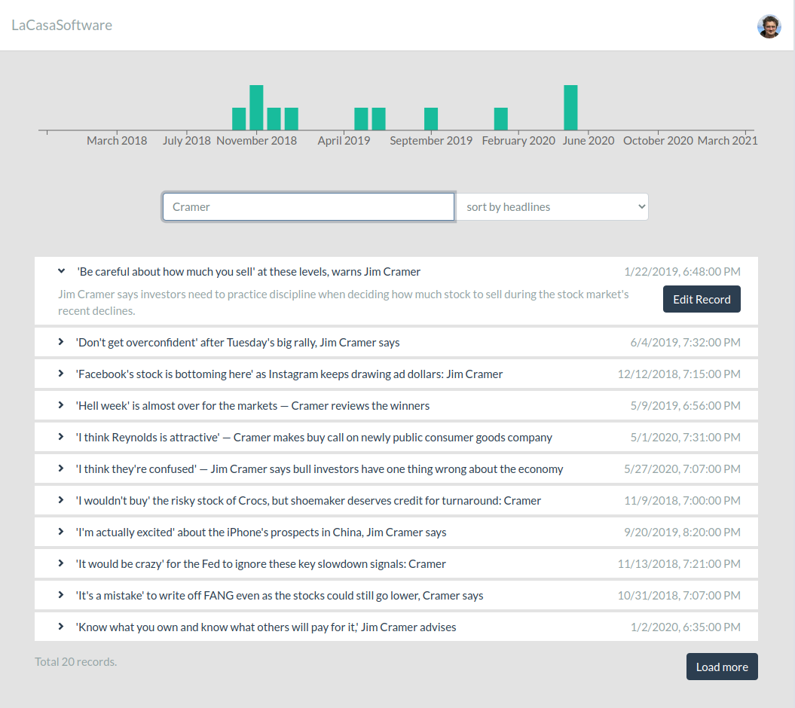

# LaCasa Software

This is a test example working with the news data.

## Demo site

There is a [demo site running at heroku](https://la-casa-software.herokuapp.com).



The application
- shows a list of news, ordered by time (desc) or title (asc)
- shows a time distribution of news (top chart)
- shows overview and detailed view of records (click the headlines)
- allows loading more records by pressing the button "Load more"
- allows filtering displayed news (by headlines)
- allows editing a record by clicking the "edit" button (in detail view, must be opened first)

## Project setup
```
git clone https://github.com/jaroslavpsenicka/la-casa-software
cd la-casa-software
yarn install
yarn server
```
To run the server tests, please make sure the server (`yarn server`) is running
```
yarn test-server
```
To run the client tests, the server is not required
```
yarn test-client
```

## Implementation notes
### Server side
The server is standard NodeJS/Express application, the code is organized as follows:
```
server
 +- routes          -- REST API
 +- services        -- implementation of a logic
 +- tests           -- API tests (JEST)
 - config.js        -- configuration (logging etc.)
 - server.js        -- server code
```
All CSV data are loaded during the startup and kept in memory. To optimize the response time, the server pre-calculates a couple of indexes. This increases the startup time, but is efficient during runtime. The server uses an original (unmodified) dataset.csv stored in /data/dataset.csv

The server implements simple bubble sort algorithm as requested, see [~/server/services/functions.js](server/services/functions.js).

The server uses @fast-csv to handle CSV data, this pretty library allows reading and transforming the data, see the `readData` method in [~/server/services/news.js](server/services/news.js).

The filesystem watch is implemented using simple `fs.watch` method. To avoid issues during update, the watecher is closed and recreated when the write is complete. See the `findAndUpdate` method in [~/server/services/news.js](server/services/news.js).

### Client side
The client is standard React/Bootstrap application, the code is organized as follows:
```
client
 +- components     -- UI components
 +- pages          -- UI compositions
 +- static         -- static ciontents, such as images
 +- tests          -- API tests (JEST)
 - App.css         -- global styles
 - index.js        -- renderer
 - NewsContext.js  -- news data context 
```
The client uses Axios for data fetching and they are kept within the context. This is very simple solution, for larger applications would be better to use the redux/thunk aproach.
 
## Testing notes
### Server side
The server tests are standard JEST tests issuing REST requests and checking results, no mocking here. Please make sure the server is running before launching `yarn test-server`.

### Client side
Client tests are JEST/Enzyme tests with quite some use of mocking:
* the context is mocked
* the ResizeObserver (required by recharts] are mocked as well
 
## Perfomance notes
### Server side
The server performs well, while using indexes. See the test results running locally:
```
  Reading News
    ✓ default query (47 ms)
    ✓ with page (11 ms)
    ✓ with size (6 ms)
    ✓ sorted by headlines (4 ms)
    ✓ edge records (79 ms)
    ✓ edge records, second page (36 ms)
    ✓ negative page (7 ms)
    ✓ non existing page (7 ms)
    ✓ negative size (3 ms)
    ✓ non existing index (3 ms)
  Updating News
    ✓ fine (3635 ms)
    ✓ xss (3394 ms)
    ✓ bad id (7 ms)
    ✓ bad request (4 ms)
```
Exporting chunks of data takes time (indexes are recalculated during these operations), this might be optimized by offloading the heavy processing, instead of (simplified):
```
format.writeToPath(DATASET, data, { ...config.csv.options, transform })
  .on('error', (err) => reject(err))
  .on('finish', () => {
     createIndexes(data);
     resolve(data[id]);
   })
```
we may use
```
format.writeToPath(DATASET, data, { ...config.csv.options, transform })
  .on('error', (err) => reject(err))
  .on('finish', () => {
     setTimeout(() => createIndexes(data), 0);
     resolve(data[id]);
   })
```
This reduces the response time to approx 200ms in exchange for potential risk of incoming request to not yet completed index.

### Client side
For client performance report, see [the Lighthouse report](https://htmlpreview.github.io/?https://raw.githubusercontent.com/jaroslavpsenicka/la-casa-software/master/doc/la-casa-software.herokuapp.com-20210306T184823.html.

## Potential improvements
### Server side
* better data storage :)
* extend the service to allow querying the whole dataset (separate endpoint probably)

### Client side
* allow querying the whole dataset (ideally by just pressing Enter in the filter field)
* problem redrawing the SearchField on every kepypress, workaround using `autoFocus`

